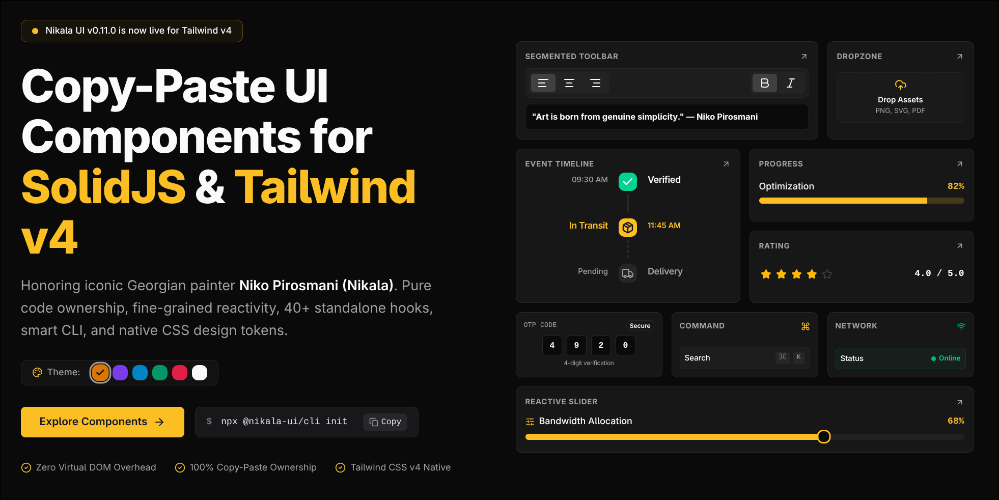

<p align="center">
  <a href="https://nikala.dev">
    
  </a>
</p>

# Nikala UI

### SolidJS + Tailwind v4 Native UI Kit

**Copy-paste components. Zero wrapper runtime. Full code ownership.**

Honoring iconic Georgian painter **Niko Pirosmani (Nikala)**.

[](https://www.npmjs.com/package/@nikala-ui/cli)
[](https://www.npmjs.com/package/@nikala-ui/cli)
[](https://github.com/sponsors/magradze)
[](https://solidjs.com)
[](https://tailwindcss.com)
[](https://nikala.dev/docs/desktop)
[](https://nikala.dev/docs/mcp)
[](https://opensource.org/licenses/MIT)

[Documentation](https://nikala.dev) • [Components (69+)](https://nikala.dev/docs/components) • [Primitives (47+)](https://nikala.dev/docs/hooks) • [Desktop Suite](https://nikala.dev/docs/desktop) • [Playground](https://nikala.dev/playground)

> If you find Nikala UI useful, please consider giving the repository a star ⭐ to help other SolidJS developers discover it!

---

## Quick Start

Initialize Nikala UI in your SolidJS, SolidStart, or Tauri workspace in seconds:

```bash
# 1. Initialize configuration and CSS design tokens
bunx @nikala-ui/cli init

# 2. Add accessible UI components or hooks
bunx @nikala-ui/cli add button card dialog
bunx @nikala-ui/cli add -h createClipboard createTheme
```

---

## Why Nikala UI

- **100% Copy-Paste Ownership** — Source code lives directly in your `src/components/ui/` and `src/hooks/` folders. Zero runtime wrapper overhead, zero vendor lock-in.
- **Tailwind CSS v4 Native** — Built around modern `@import "tailwindcss";` semantic design tokens with `@theme` compatibility and automatic dark mode.
- **Fine-Grained SolidJS Reactivity** — Engineered with `splitProps` and signal accessors for optimal reactivity without Virtual DOM overhead.
- **Tauri v2 Desktop Suite** — First-class desktop primitives: frameless window titlebars, macOS traffic lights, multi-document tabs, and in-app auto-updaters.
- **47+ Standalone Reactive Primitives** — Keyboard shortcuts, network listeners, chat scrolling, dropzones, window size, and clipboard signals.
- **AI-Native MCP Server** — Callable Model Context Protocol tools and system prompts for Cursor, Claude, and Antigravity.

---

## Comparison

| Feature | Nikala UI | shadcn/ui | Kobalte |
| :--- | :---: | :---: | :---: |
| **SolidJS Native** | ✅ (Signals) | ❌ (React only) | ✅ |
| **Tailwind CSS v4 Native** | ✅ (`@theme`) | ⚠️ (v3 Primary) | ❌ (Unstyled) |
| **Tauri v2 Desktop Suite** | ✅ (Titlebar, Tabs, Updater) | ❌ | ❌ |
| **47+ Reactive Primitives** | ✅ (Built-in Suite) | ❌ | ❌ |
| **100% Copy-Paste Ownership** | ✅ | ✅ | ❌ (`npm` dependency) |
| **Wrapper Runtime Overhead** | 0kb (Copy-paste) | 0kb (Copy-paste) | ~30kb |
| **Native MCP Server** | ✅ (`@nikala-ui/mcp`) | ✅ (Registry MCP) | ❌ |

---

## Tauri Desktop Suite

Frameless window headers, macOS traffic lights, and multi-document tabs engineered for **Tauri v2**:

```tsx
import { Titlebar, TitlebarControls, TitlebarTabs } from "@/components/ui/titlebar";
import { createDocumentTabs } from "@/hooks/create-document-tabs";

export function DesktopApp() {
  const tabs = createDocumentTabs({ initialTabs: [{ id: "App.tsx", title: "App.tsx" }] });

  return (
    <Titlebar platform="macos" class="h-10 bg-card border-b">
      <TitlebarControls platform="macos" />
      <TitlebarTabs manager={tabs} variant="pills" onAddTab={() => tabs.addTab({ id: "New.tsx", title: "New.tsx" })} />
    </Titlebar>
  );
}
```

[Read Desktop Documentation & Guides](https://nikala.dev/docs/desktop)

---

## Model Context Protocol (MCP)

Nikala UI ships with an official MCP server for AI-assisted development in **Cursor**, **Claude**, and **Antigravity**:

```json
{
  "mcpServers": {
    "nikala-ui": {
      "command": "npx",
      "args": ["-y", "@nikala-ui/mcp"]
    }
  }
}
```

---

## Used By

- [**nikala.dev**](https://nikala.dev) — Official documentation, interactive component previews & playground.

---

## Community

- **Discussions & Q&A**: [GitHub Discussions](https://github.com/nikala-ui/ui/discussions)
- **Bug Reports & Issues**: [GitHub Issues](https://github.com/nikala-ui/ui/issues)
- **Security Policy**: [SECURITY.md](./SECURITY.md)
- **Contribution Guide**: [CONTRIBUTING.md](./CONTRIBUTING.md)
- **Changelog**: [CHANGELOG.md](./CHANGELOG.md)

---

## Sponsor & Support

Nikala UI is completely free and open-source under the **MIT License**. If it helps you build faster or saves you development time, please consider starring the repository and sponsoring its ongoing development:

[](https://github.com/sponsors/magradze)

### Backers

*Become the first backer supporting Nikala UI development!*

---

## License

[MIT](./LICENSE) © [Giorgi Magradze](https://github.com/magradze)
